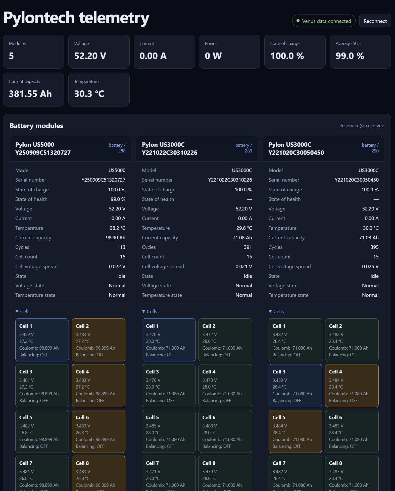
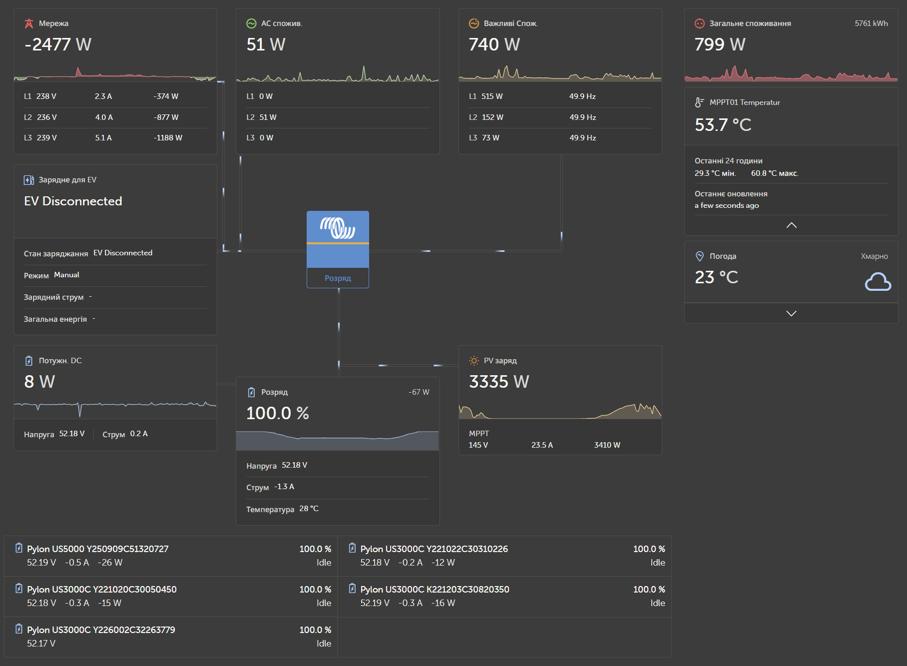
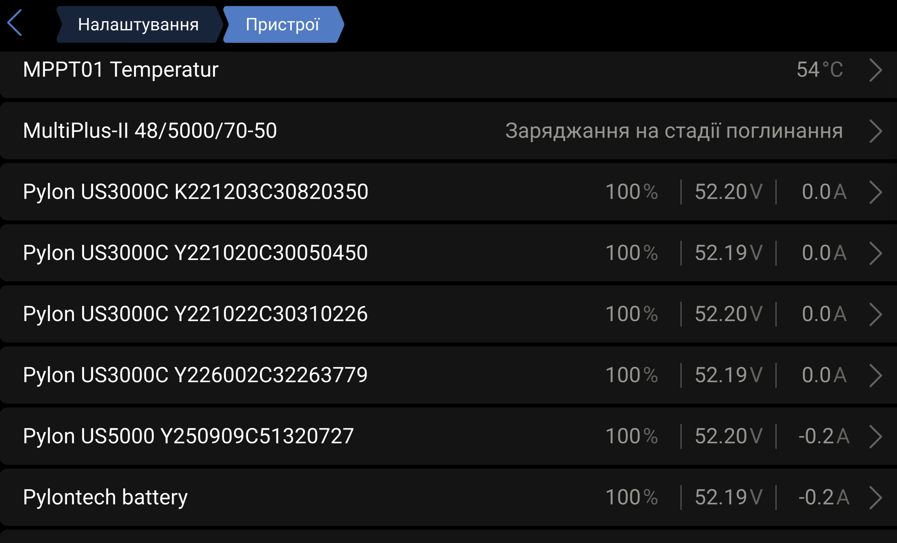

# dbus-pylontech-console

Read-only Pylontech/Pytes RS232 telemetry for Victron Venus OS. The driver
reads the console port of the master battery and publishes live bank values,
individual battery modules, statistics, and cell telemetry on D-Bus.

The project is intentionally read-only: it never changes battery settings,
starts or stops charging, sends control commands, or writes to ESS/DVCC
services.

## What it provides

- bank voltage, current, power, SOC, temperature, and online/offline counts;
- one D-Bus service for each online battery module;
- module manufacturer, model, serial number, specification, firmware, and
  hardware information;
- cycle count, SOH when the firmware reports a valid value, and available
  `stat` counters;
- current capacity derived from the Pylontech `Coulomb` value;
- cell voltage, current, temperature, SOC, Coulomb capacity, and balancing
  state;
- minimum/maximum cell voltage, cell spread, temperature extrema, and MOS
  temperature when supplied by the firmware;
- stale-value invalidation after repeated communication failures;
- automatic serial-starter integration for a selected USB adapter;
- a standalone browser telemetry panel served by the existing Venus web
  server, with no additional HTTP service.

## Screenshots

Standalone telemetry panel with bank values, module cards, capacity, cell
voltages, Coulomb capacity, and balancing state:



Venus GX overview showing the normal system context:



Venus Device List showing each Pylontech module as a separate device named
from manufacturer, model, and serial number:



## Hardware and wiring

### Battery console cable

Connect the cable to the **Console/RS232** port of the Pylontech master
battery. The console port is not an Ethernet network port and must not be
connected to a switch. It is also different from the CAN and RS485 link ports.

Use a cable made for the exact battery family and connector revision. Depending
on the model, the battery side may be RJ45 or RJ11/RJ12 and the cable may end
in DB9 or directly in USB. The cable must carry RS232 TX, RX, and GND with the
correct Pylontech pinout; a normal Ethernet patch cable is not a substitute.
Do not connect wake-up/power pins unless the battery manual explicitly
requires it.

For a battery stack, connect the console cable to the master. The driver reads
the modules behind that master and does not require one USB cable per battery.

### USB-RS232 adapter

Use a **real RS232-level** USB adapter supported by Linux. It should enumerate
as `/dev/ttyUSB0` (or another `/dev/ttyUSB*` device) and support:

- 115200 baud;
- 8 data bits, no parity, 1 stop bit (8N1);
- no hardware or software flow control.

FTDI, CP210x, and CH34x-based adapters are commonly available, but the
chipset alone does not guarantee a correct cable. Do not use a 3.3 V/5 V TTL
UART adapter: TTL UART is electrically different from RS232 and can damage the
adapter or battery. Keep the cable short and use a shielded, reliable adapter
for a permanent installation.

On Venus OS, check the adapter before installing:

```sh
ls -l /dev/ttyUSB*
udevadm info --query=property --name=/dev/ttyUSB0 | grep -E 'ID_SERIAL_SHORT|ID_PATH|ID_VENDOR|ID_MODEL'
```

The installer prefers a unique `ID_SERIAL_SHORT`; if the adapter has no serial
number it uses the physical `ID_PATH` so the selected USB socket remains stable.

## D-Bus namespaces

The default service name is:

```text
com.victronenergy.battery.pylontechmonitor_rs232
```

This makes the telemetry visible on the standard Venus battery page. It is
read-only and deliberately omits ESS/DVCC limit paths, but Venus may still
offer a `battery` service as an ESS battery candidate. Do not select it as the
active ESS battery unless that behaviour is explicitly wanted.

For telemetry that must never appear as a battery candidate, set:

```ini
[driver]
service_name = com.victronenergy.dcload.pylontechmonitor_rs232
```

Each online module is exposed as a suffixed service, for example
`...pylontechmonitor_rs232_1`, `..._2`, and so on. The visible product name is
built from the BMS-reported manufacturer, model, and serial number.

Useful paths include:

```text
/Soc                              aggregate state of charge
/System/Soh                       aggregate SOH when available
/Dc/0/Voltage                     bank voltage
/Dc/0/Current                     bank current
/Dc/0/Power                       bank power
/Capacity                         current bank capacity when configured
/Modules/<n>/Soh                  module SOH
/Modules/<n>/RemainingCapacity    module current capacity
/Modules/<n>/Cycles               module cycle count
/Modules/<n>/Cells/<c>/Voltage
/Modules/<n>/Cells/<c>/RemainingCapacity
/Modules/<n>/Cells/<c>/Balancing
/Modules/<n>/Statistics/*         raw and normalized stat counters
```

`Coulomb` in the Pylontech `bat N` response is published as
`RemainingCapacity` in Ah. A module's current capacity is derived from the
cell telemetry; configured nominal capacity is separate and is only used for
`/InstalledCapacity` when `battery.module_capacity_ah` is set.

## Read-only command scope

The live service uses only these console queries:

- `pwr` for live module and bank values;
- `info N` for identity, firmware, specification, and cell count;
- `stat N` for cycles, SOH, SOC, and lifetime counters;
- `bat N` for cell measurements, Coulomb capacity, and balancing state.

The detail queries run every `driver.details_poll_interval` seconds. Firmware
varies between Pylontech and Pytes models, so an unsupported field is left
empty. The driver never issues `config`, `ctrl`, `prot`, `shut`, reset,
calibration, firmware-update, or arbitrary console commands.

## Configuration

Copy the example configuration and review it before starting the service:

```sh
cp config.ini.example config.ini
vi config.ini
```

Important settings:

| Setting | Purpose |
| --- | --- |
| `serial.port` | Serial device; normally `/dev/ttyUSB0` |
| `serial.baudrate` | Console speed; normally `115200` |
| `serial.command_delay` | Delay between queries; `1.2`–`2.0` is conservative |
| `battery.expected_modules` | Module count; `0` enables discovery |
| `battery.module_capacity_ah` | Optional nominal capacity per module |
| `battery.max_modules` | Maximum D-Bus module slots |
| `battery.max_cells_per_module` | Maximum cell paths reserved per module |
| `driver.poll_interval` | Live `pwr` interval in seconds |
| `driver.details_poll_interval` | `info`/`stat`/`bat` interval in seconds |
| `driver.failure_threshold` | Consecutive failures before disconnect |
| `driver.poll_timeout` | Watchdog limit for one serial poll; the process exits so serial-starter can restart it |
| `driver.device_instance` | Unique Venus device instance |
| `driver.service_name` | `battery` or isolated `dcload` namespace |

## Test the cable before installing

Stop any service that currently owns the serial port. The probe uses an
exclusive serial lock and never connects to D-Bus:

```sh
cd /data/dbus-pylonserial-main
python3 probe.py --port /dev/ttyUSB0 --expected-modules 0
```

To retrieve identity, SOH, cycles, cells, Coulomb capacity, and balancing:

```sh
python3 probe.py \
  --port /dev/ttyUSB0 \
  --expected-modules 0 \
  --details \
  --command-delay 2.0 \
  --timeout 15 | tee /tmp/pylontech-details.json
```

Inspect SOH and the raw parsed counters with:

```sh
grep -n -i -E 'soh|raw_counters|remaining_capacity' /tmp/pylontech-details.json
```

For the original `pwr` console response rather than parsed JSON:

```sh
python3 probe.py --port /dev/ttyUSB0 --raw
```

If a slow battery stack times out, increase `--command-delay` and
`--timeout`. Always stop the supervised service before running the probe,
then start it again afterward.

## Installation on Venus OS

Copy the repository to the GX device, then run as root. For serial-starter
integration, pass the adapter path currently assigned by Venus OS:

```sh
chmod +x install.sh restore-serial-starter.sh \
  serial-starter/service/run serial-starter/service/log/run
./install.sh --serial-starter /dev/ttyUSB0
```

The installer:

1. installs the read-only Python driver and service templates;
2. creates a narrow udev rule for this adapter only;
3. registers the selected TTY with serial-starter;
4. copies the standalone panel into the existing Venus web root when it is
   available;
5. removes obsolete GUI v2 plugin artifacts from older installations.

Review the persistent configuration:

```sh
vi /data/apps/dbus-pylontech-console/config.ini
```

Check service status and live logs:

```sh
svstat /service/dbus-pylonserial.ttyUSB0
tail -F /data/log/dbus-pylonserial.ttyUSB0/current | tai64nlocal
```

The standalone panel is available at:

```text
https://<cerbo-address>/gui-v2/pylontech-panel/
```

It uses the existing Venus `/websocket-mqtt` endpoint and does not start a
separate HTTP server. For local development or a different host, append
`?host=<venus-ip>` to the URL.

## Manual standalone service

For development without serial-starter:

```sh
./install.sh
vi /data/apps/dbus-pylontech-console/config.ini
rm /data/apps/dbus-pylontech-console/service/down
svc -u /service/dbus-pylontech-console
```

Status and restart:

```sh
svstat /service/dbus-pylontech-console
svc -t /service/dbus-pylontech-console
```

## Troubleshooting

**`ServiceUnknown` or no device in Device List**

Check that the service is supervised and that the configured service name is
the one being queried:

```sh
svstat /service/dbus-pylonserial.ttyUSB0
dbus-send --system --print-reply \
  --dest=org.freedesktop.DBus /org/freedesktop/DBus \
  org.freedesktop.DBus.ListNames | grep -i pylon
```

**`/dev/ttyUSB0` is missing**

Check the USB adapter, reconnect it, and inspect `dmesg`/`udevadm`. A TTY
number can change after reconnect; rerun the installer with the current path.

**The panel says “Waiting for Pylontech data”**

The browser is connected to Venus, but no retained telemetry has arrived.
Check the serial-starter service and run the standalone probe after stopping
the service. Refresh the panel after the driver publishes its first `pwr`
sample.

**SOH is shown as `—`**

Some firmware returns `SOH: 0` or omits SOH for individual modules. The driver
represents that as unavailable rather than reporting a false 0%. Verify the
raw `stat N` response with `probe.py --details`.

**The process uses excessive CPU or two readers appear**

Stop manually launched `main.py` processes before starting the supervised
service. Only one process may own the console port. If repeated installer runs
left stale supervisors, stop the TTY first and inspect the remaining PIDs:

```sh
svc -d /service/dbus-pylonserial.ttyUSB0
/opt/victronenergy/serial-starter/stop-tty.sh ttyUSB0 2>/dev/null || true
ps | grep '[s]upervise dbus-pylonserial.ttyUSB0'
```

Terminate only the listed stale `supervise` PIDs, then activate the service once
with `start-tty.sh` or by reconnecting the adapter. Do not run both activation
methods for the same TTY.

**The PID is alive but values stopped updating**

Check both the supervisor and application logs. A live PID is not proof that a
serial poll is still making progress: the driver has a watchdog and exits when
one poll exceeds `driver.poll_timeout`, allowing serial-starter to restart it.

```sh
tail -n 100 /data/log/serial-starter/current | tai64nlocal
tail -n 100 /data/log/dbus-pylonserial.ttyUSB0/current | tai64nlocal
svstat /service/dbus-pylonserial.ttyUSB0
readlink -f /service/dbus-pylonserial.ttyUSB0
```

The application log now records each poll duration and the watchdog message.
If a USB adapter or kernel driver ignores `close()`, the poll worker is a
daemon thread, so it cannot keep the process alive after the main loop exits.

If the service cannot resolve its TTY, it now exits instead of silently using
`/dev/TTY` or attaching the logger to an arbitrary stale service. Inspect
`/data/log/serial-starter/current` and recreate the service for the actual
adapter name (for example `ttyUSB0`).

## Uninstall

To disable the integration and return the adapter to normal Venus probing:

```sh
/data/apps/dbus-pylontech-console/uninstall.sh
```

The uninstaller removes this project's service, udev, serial-starter, and
standalone-panel registrations. It preserves `config.ini` and application
files so the installation can be inspected or restored later.

## Development and tests

The parser and D-Bus publication tests can run on a regular Python
installation:

```sh
python -m unittest discover -v
```

Full D-Bus integration requires Venus OS (or a Linux environment with
`dbus`, PyGObject, and Victron `velib_python`).

## Author

Created by [Stas Dovgodko](https://github.com/stas-dovgodko). Made in Ukraine.

## License

This project is based on the console parsing approach used by `pytes_serial`,
licensed under AGPL-3.0. It is distributed under AGPL-3.0-only; attribution
is retained in [NOTICE](NOTICE) and the terms are in [LICENSE](LICENSE).
